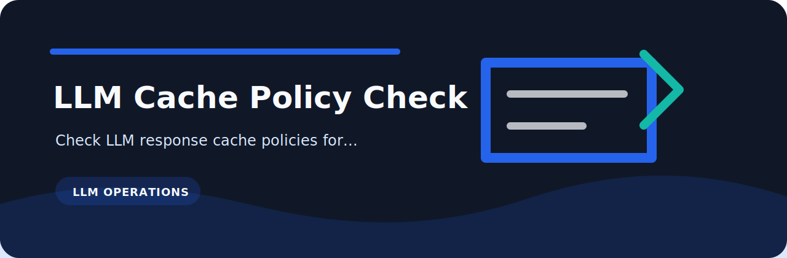

<p align="center">
  
</p>

# LLM Cache Policy Check

   

Check LLM response cache policies for privacy, TTL, and key-scope gaps.

## Why it exists

Small review tasks are easy to skip when the signal lives in notes, spreadsheets, or loosely formatted exports. `llm-cache-policy-check` turns those checks into a repeatable command with plain findings and CI-friendly exit codes.

## Quick run

```bash
python -m pip install -e ".[dev]"
llm-cache-policy-check examples/sample.txt
llm-cache-policy-check examples/sample.txt --json --fail-on medium
```

## Rule set

| Rule | Severity | What it catches |
| --- | --- | --- |
| `no-ttl` | high | cache TTL missing |
| `pii-cache` | medium | PII may be cached |
| `global-scope` | low | cache scope is global |

## Input

The reader accepts plain text, JSON, JSONL, and CSV. That keeps it useful for hand-written notes, review exports, and small automation jobs.

## Sample risky input

```text
cache enabled ttl none pii true scope global
```

## Development

```bash
python -m pip install -e ".[dev]"
ruff check .
pytest
python -m llm_cache_policy_check --help
```

`cli.py` handles arguments, `core.py` reads and evaluates records, and `rules.py` keeps the LLM Cache Policy Check policy easy to review.
