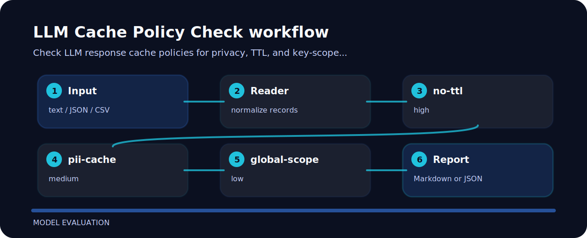

# LLM Cache Policy Check


## Review intent

LLM Cache Policy Check is meant for quick pull-request checks around LLM operations. It favors explicit rules over a bulky dashboard.

| Detail | Value |
| --- | --- |
| Area | model evaluation |
| Entry | `llm-cache-policy-check` |
| Input | plain text |
| Output | terminal findings, optional JSON |

## Review path



| Signal | Level | What it flags | Fix direction |
| --- | --- | --- | --- |
| `no-ttl` | high | cache TTL missing | set cache TTL |
| `pii-cache` | medium | PII may be cached | disable or isolate sensitive caching |
| `global-scope` | low | cache scope is global | use tenant or user scoped keys |

## Local check

```bash
git clone https://github.com/mertefekurt/llm-cache-policy-check.git
cd llm-cache-policy-check
python -m pip install -e ".[dev]"
llm-cache-policy-check examples/sample.txt
```
